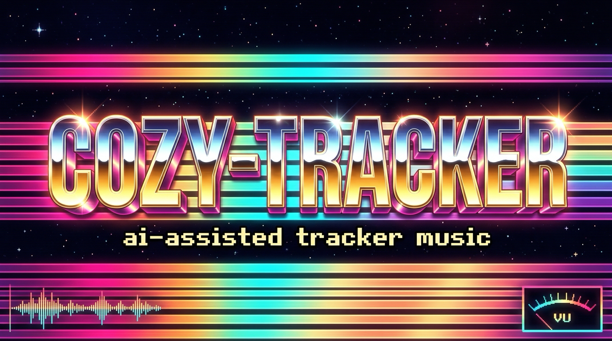

# cozy-tracker

**Live: [tracker.coze.org](https://tracker.coze.org)** — jukebox + adaptive-music
demos on the landing page, [/listen](https://tracker.coze.org/listen/) for the
focused player, [/player](https://tracker.coze.org/player/) for the browser
tracker (view + edit).

AI-assisted adaptive game music: Claude composes Impulse Tracker modules from
JSON, a human polishes them in a real tracker, and the same `.it` files play
in the browser and in games via libopenmpt — with layer/section manifests that
make the score react to gameplay. The pitch:
[docs/positioning.md](docs/positioning.md). The original stack research:
[RESEARCH.md](RESEARCH.md).

## Pipeline

```
songs/*.json ─→ tools/json2it.js ─→ build/*.it (+ *.cozy.json manifest)
                     │                   ├→ player/  — browser tracker (view/edit)
                     │                   ├→ listen/  — jukebox w/ visualizers
                     ├─ tools/lint.js    ├→ Schism Tracker (human editing)
                     └─ tools/render.js  └→ games — CozyAdaptive runtimes
                                            (web: player/cozy-adaptive.js,
                                             Godot: engines/godot/)
```

## Quickstart

```sh
npm install
node tools/json2it.js songs/demo.json   # → build/demo.it
python3 tools/serve.py 8123             # no-cache dev server, project root, localhost only
open http://localhost:8123/player/      # load ../build/demo.it, press Load
```

Human editing: `brew install --cask schism-tracker`, then open `build/*.it`.

Every push to `main` auto-deploys the site via GitHub Actions
([.github/workflows/deploy.yml](.github/workflows/deploy.yml)) — Pages source
must be set to "GitHub Actions" in the repo settings.

## Composing with an agent

Read [the composition skill](skills/mod-music/SKILL.md). For chip idioms (J stabs, echoes, canon
shimmer, gated hats, bass register, loop seams) also read
[the chiptune skill](skills/chiptune/SKILL.md). It covers motifs,
question/answer phrases, rhythm, voice leading, articulation, effects and revision.
The [song audit](docs/song-audit.md) explains the demonstrated defects and remaining
limits; [corpus studies](docs/corpus-studies.md) separate evidence from recipes.

A portable original teaching loop uses no downloaded samples:

```sh
npm test
npm run build:example           # generates Lantern Walk JSON + IT
npm run lint:example            # strict check for this supported fixture
node tools/render.js build/lantern_walk.it
```

Open `player/?song=../build/lantern_walk.it` on the local server to audition it.

The **Opus 5.5 batch** — [Peach Orchard](songs/peach_orchard.gen.js),
[Tide Pool Radio](songs/tide_pool_radio.gen.js), [Crypt Lanterns](songs/crypt_lanterns.gen.js)
and [Skyline Relay](songs/skyline_relay.gen.js) — applies idioms from the Drozerix
corpus (canon shimmer, auto-panned arps, gated hats, octave-flicker stabs) with
fully synthesized samples; shared articulation helpers live in
[songs/opus55.js](songs/opus55.js). Each generator's header states its grid,
phrase map and what it borrowed. They are in the jukebox playlist.

The **Gpt-6 Astra batch** — [Pocket Tram](songs/pocket_tram.gen.js),
[Copper Kite](songs/copper_kite.gen.js), [Moth Clock](songs/moth_clock.gen.js),
and [Glass Harbor](songs/glass_harbor.gen.js) — adds four original pieces studied
from the local Drozerix MOD/XM references: syncopated chip-pop, a Dorian chase,
a minor-key waltz, and a spacious nocturne. Generators, portable JSON and compiled
`demos/*.it` modules are included, with model credits in the module messages and
playlist. See [the batch notes](docs/astra-batch.md) for reference pattern evidence,
phrase maps, regeneration commands, revisions and verification. Listening remains
unverified; structural checks and renders do not establish musical quality.

`npm run build` compiles `songs/demo.json`; use `json2it.js` for other songs.
Sample `volume` is a default, replaced by a note's explicit `vNN`. Lower event
volumes or `mixvol` when balancing notes that already stamp their volume.

## Layout

- `songs/` — song sources (JSON, itwriter structure + `synth`/`file` sample specs)
- `tools/` — `json2it.js` (compiler), `render.js` (module → WAV + stats),
  `analyze.js` (module structure/stats/pattern dumps), `synth.js`, `wav.js`
- `skills/mod-music/` — the canonical composition skill, with musical guidance,
  verified tracker semantics and critical example studies; discoverable through
  `.agents/skills/` and `.claude/skills/`
- `vendor/itwriter/` — vendored [itwriter](https://github.com/chr15m/itwriter) (MIT),
  patched: sample loop points, default volume, C5Speed override
- `player/` — browser tracker: pattern view with playhead, VU meters, oscilloscope,
  per-channel **solo/mute** (engine-level, via libopenmpt's ext interface),
  and an **edit mode** for `.json` songs (piano-roll keyboard with audition,
  instrument add/remove, in-browser itwriter compile, ⬇ json/.it export). Space = pause/resume; with unsaved
  edits in edit mode, Space recompiles and plays the selected pattern. ▶ after ■ replays
  the loaded song, edits included. Wide songs scroll sideways (wheel/drag). Keys: z s x d c v g b h n j m = C..B,
  q 2 w 3 e … = octave up, i 9 o 0 p = two up, a = note off, Delete = remove,
  arrows/PgUp/PgDn = cursor, [ ] = octave, click = place cursor.
  `player/vendor/chiptune3/` is vendored [chiptune3](https://github.com/DrSnuggles/chiptune)
  (MIT/BSD), patched: per-channel VU + formatted pattern data
- `listen/` — jukebox player + `jukebox.js` component (playlist, transport,
  wave/bars/rings live visualizers) — embedded on the landing page too
- `demos/` — the shipped modules + adaptive manifests the site plays
- `engines/godot/` — CozyAdaptive runtime for Godot 4 (godot-openmpt)
- `docs/` — [positioning.md](docs/positioning.md) (the pitch),
  [corpus-studies.md](docs/corpus-studies.md) (five pattern-level Drozerix
  deep dives with adoptable recipes)
- `index.html` / `assets/` / `CNAME` — the landing page at tracker.coze.org
- `.claude/skills/` — `mod-music` (composition) and `bridge` (song-to-song
  transitions) skills
- `library/` — samples/modules/corpus (not in git; see library/README.md for rules)
- `build/` — generated `.it` files (not in git)

## Song JSON

The itwriter structure (title/bpm/ticks/samples/patterns/order — see
`vendor/itwriter/UPSTREAM-README.md`), with extended sample definitions:

```jsonc
{ "name": "bass",  "synth": { "wave": "square", "pulse": 0.25, "volume": 42 } },
{ "name": "kick",  "synth": { "wave": "kick", "seconds": 0.3 } },
{ "name": "flute", "file": "library/samples/akwf/AKWF_0001.wav", "loop": "cycle" }
```

Waves: `sine|square|saw|triangle` (single-cycle, looped, C-5 = middle C),
`noise|kick` (one-shot percussion), `pluck` (decaying pitched tone).
Noise supports a repeatable `seed`; cycle waves are centered to remove DC. `loop: "cycle"` loops a WAV file
end-to-end as a single-cycle waveform and tunes it automatically.

## Rendering / verifying output

`node tools/render.js build/song.it` renders to `build/song.wav` via the same
libopenmpt WASM the player uses, and prints duration/peak/RMS/clipping stats
(add `--stats-only` to skip the WAV). `node tools/lint.js songs/song.json` validates the source and checks the written
order timeline for sustained notes, arpeggio clashes and density. `--json` emits
a structured report; `--strict` fails on warnings or incomplete simulation.
Warnings need musical judgment: a clean report and healthy RMS do not prove
a good tune. In sample mode, `==` does not stop ordinary loops; use `^^` and
shape the volume before a cut when needed. Audition the render and loop seams.

## Adaptive music (CozyAdaptive)

Songs can declare an `adaptive` block (intensity-ordered layers + named
sections); `json2it` then emits a `<name>.cozy.json` manifest next to the
`.it`. The web runtime [player/cozy-adaptive.js](player/cozy-adaptive.js)
pairs the two:

```js
const music = await CozyAdaptive.create('siege_engine.it', 'siege_engine.cozy.json');
music.setIntensity(0.7);                          // engine-level layer muting
music.transitionTo('combat', { via: 'bridge' });  // jump at the next pattern boundary
```

Sections loop themselves until a transition is requested. Requests are handled
at observed pattern boundaries; main-thread scheduling can delay a seek, so
section transitions are approximate and should be auditioned in context.
`create()` rejects (rather than hanging) if the worklet, manifest or module
fails to load or times out (`{ timeout: 15000 }` by default); call
`music.dispose()` when finished to release the AudioContext. Live demo on the
landing page ([index.html](index.html)). See
[docs/positioning.md](docs/positioning.md) for the why.

### Bridging two songs into one module

[tools/merge.js](tools/merge.js) merges two songs plus a composed bridge into
a single adaptive module: B's channels/instruments are remapped after A's,
every pattern's row 0 is stamped with its song's tempo/speed/loudness
(Txx/Axx/Vxx on control channels), and section names get prefixed. The bridge
itself is authored music — see
[songs/siege_to_night.gen.js](songs/siege_to_night.gen.js), which walks
Siege Engine (E minor, 150 BPM) into Night Bus (A minor, 112 BPM) over an
E pedal (v→i) with a stepped tempo ramp. Then:

```js
music.transitionTo('nb:groove', { via: 'bridge' }); // cross songs, musically
```

## Analyzing modules

`node tools/analyze.js <module>` prints structure + stats (tempo, channels,
effect usage, note ranges); `--pattern N` prints a tracker grid; `--corpus <dir>`
sweeps a directory. Drozerix corpus results: `build/analysis/drozerix.json`.

## TODO

- IT instrument support (envelopes, NNA) in vendored itwriter
- `.it` reader for round-tripping human edits back to JSON
- Unity CozyAdaptive wrapper (P/Invoke over libopenmpt)
- Godot wrapper smoke test in a real project (API-verified, not yet run)
